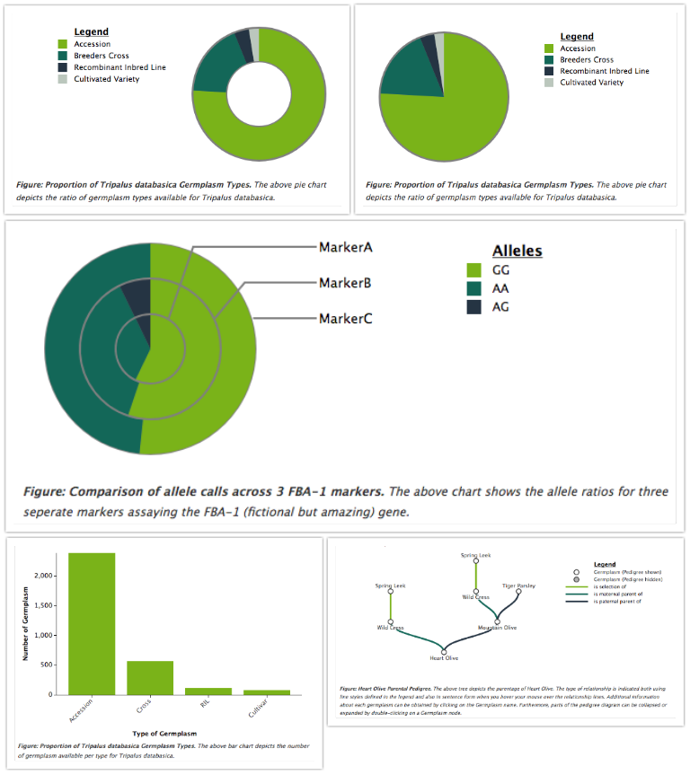

# Tripal d3.js API

Provides d3.js integration for Tripal. It provides an API for developing consistent biological diagrams with a common configuration, as well as, providing some common diagrams such as pie, bar, column and pedigree diagrams.

NOTE: This module is an API and does not provide user facing diagrams. Rather, you would use this API to easily draw common diagrams within your own fields. For an example of how to use this module, see [Tripal Fancy Fields](https://github.com/tripal/trpfancy_fields).

## Quickstart
1. Unpack the [D3 v3 javascript library](https://github.com/d3/d3/releases?after=v4.0.0) in your Drupal Libraries directory (quick check, you should have a libraries/d3/d3.min.js file; for more information see the drupal.org documentation).
2. Download and install this module as you would any other Drupal module ([Documentation](https://www.drupal.org/documentation/install/modules-themes>))
3. (Optional) Go to Admin » Tripal » Extension Modules » Tripal D3 Diagrams to configure colour schemes, etc.

### Dependencies
1. [Tripal 3.x](https://www.drupal.org/project/tripal)
2. [Drupal Libraries API](https://www.drupal.org/project/libraries)
3. [D3 v3 javascript library](https://github.com/d3/d3/releases?after=v4.0.0)

## Browser Support
All Diagrams Tested on:
- Chrome 40.0.2214.111
- Firefox 35.0.1
- Safari 8.0.2
- Internet Explorer 11

## Diagrams
All of the following diagrams are presented to the user as a "Figure" with the
title and description below the diagram in the style of scientific journals.
Furthermore, all diagrams have a consistent, configurable colour scheme and key.
- Simple Pie Chart
- Donut Pie Chart
- Multi-Ring Pie Chart (Multiple series)
- Simple Bar Chart
- Histogram
- Pedigree Diagram

## Screenshots from Demo
The following screenshots are from the Demo available on the Tripal D3 admin pages (Admin » Tripal » Extension Modules » Tripal D3 Diagrams » Demo) and are meant to give you an idea of what kind of charts can be created using this API.

## Documentation
Please visit our [online documentation](https://tripal-d3js-api.readthedocs.io/en/latest/) to learn more about installation, usage and features.
