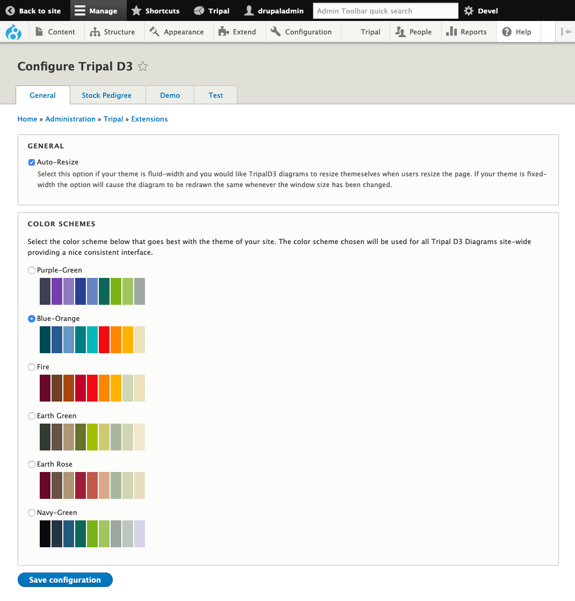

Configuration
===============

Configuration can be found at Admin » Tripal » Extension Modules » Tripal D3 Diagrams. Configuration has been kept simple to lower the administrative needs of this module.

As you can see from the above screenshot, the main configuration options are related to the colour scheme of the diagrams. This is one of the main features of the API which allows your diagrams to look professional by being consistent in colour scheme across your site. Simply choose on of the preset colour schemes or add your own :doc:`dev_guide/color_scheme`.
