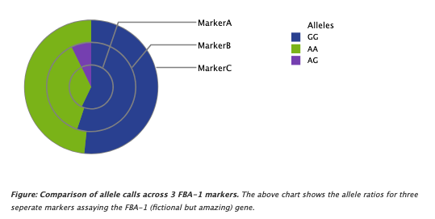

Draw a Multi-series Donut
===========================

1. Load the API into the page you would like your diagram using ``<php tripald3_load_libraries();?>``
2. Retrieve you data and manipulate it into the structure required by the chart. This can be done a number of ways, the easiest of which is to query your database in your Drupal preprocess hook and then save the results as a javascript setting.

.. code-block:: php

  /**
   * Preprocess hook for template my_example.tpl.php
   * The module name is demo.
   */
  function demo_my_example_preprocess(&$variables) {

    // Load the API (Step #1 above)
    tripald3_load_libraries();

    // Retrieve your data.
    // For this example  we're just going to define the array directly.
    $multiDonutData = [
      [
        "label": "MarkerA",
        "parts": [
          [
            "label": "GG",
            "count": 16,
          ],
          [
            "label": "AA",
            "count": 10,
          ],
          [
            "label": "AG",
            "count": 2,
          ],
        ],
      ],
      [
        "label": "MarkerB",
        "parts": [
          [
            "label": "GG",
            "count": 145,
          ],
          [
            "label": "AA",
            "count": 99,
          ],
          [
            "label": "AG",
            "count": 19,
          ],
        ],
      ],
      [
        "label": "MarkerC",
        "parts": [
          [
            "label": "GG",
            "count": 78,
          ],
          [
            "label": "AA",
            "count": 73,
          ],
        ],
      ],
    ];

    // Make it available to javascript via settings.
    $settings = array(
      // Always namespace to your module to avoid collisions.
      'demo' => array(
        // Pass in your data using a descriptive settings key.
        'stockTypeDonutData' => $multiDonutData,
      ),
    );
    drupal_add_js($settings, 'setting');
  }

3. Add a container element in your template where you would like the chart drawn.

.. code-block:: html

  

    <!-- Javascript will add the Multi-series Donut Chart, Title and Figure legend here -->
  

4. Draw the chart in your template by calling `tripalD3.drawChart()`. This is done within a script tag using Drupal behaviours to ensure it is run at the correct point and the data prepared is passed in.

.. code-block:: html

  

5. There is no step #5; you're done!
