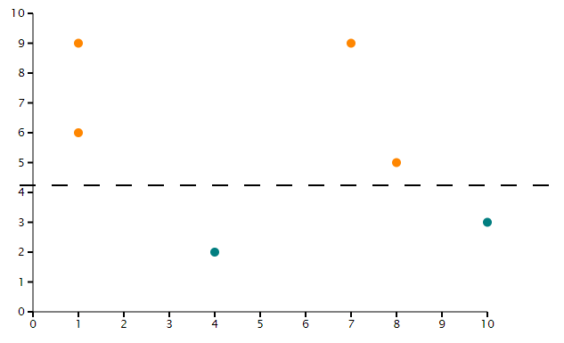

Draw a Simple Scatter Plot
=========================

1. Load the API into the page you would like your diagram using ``<php tripald3_load_libraries();?>``

.. code-block:: php

  function demo_my_example_preprocess(&$variables) {
        //the horizontal scatterplot takes in an array of javascript objects
            var scatterData = [
	{
        "x": 7,
        "y": 9
  },
  {
         "x": 10,
        "y": 3
  },
  {
        "x": 1,
        "y": 9
  },
  {
         "x": 8,
        "y": 5
  },
         {
         "x": 4,
         "y": 2
         },
  {
         "x": 1,
         "y": 6
  },
];
    }

2. Add a container element where you would like you diagram drawn.  It is important to note that the element ID specified must be the same as the div ID

.. code-block:: html

  

    <!-- Javascript will add the Simple Scatter Chart, Title and Figure legend here -->
  

3. Draw the chart in your template by calling `tripalD3.drawChart()`. This is done within a script tag using Drupal behaviours to ensure it is run at the correct point and the data prepared is passed in.

.. code-block:: html
    <script type="text/javascript">
  Drupal.behaviors.tripalD3demoSimpleScatterHorizontal = {
    attach: function (context, settings) { 
      var scatterData = [
	{
  "x": 7,
  "y": 9
  },
  {
  "x": 10,
  "y": 3
  },
  {
  "x": 1,
  "y": 9
  },
  {
  "x": 8,
  "y": 5
  },
  {
  "x": 4,
  "y": 2
  },
  {
  "x": 1,
  "y": 6
  },
];

      tripalD3.drawFigure(
        scatterData,
        {
          "chartType" : "horizontalscatter",
          "elementId" : "tripald3-scatterplot-horizontal",
          "height" : 400,
          "width" : 800,
          "xAxisPadding" : 30,
          "yAxisPadding" : 60,
        }
      );
    }
  };

