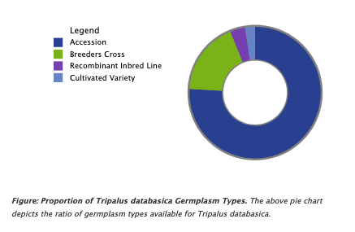

Draw a Simple Donut Chart
=========================

1. Implement hook_theme in module_name.module file. Take note of the value set for template key as this will become the name of template file in subsequent steps.

.. code-block:: php

  /**
   * Implements hook_theme().
   */
  function module_name_theme($existing, $type, $theme, $path) {  
    return [
      'theme_name_simpledonut' => [
        'variables' => [],
        'template' => 'template-name-simpledonut',
      ],
    ];  
  }

2. Create a Twig template file in module/templates/ directory and set the template name to the value of template key in the hook_theme. In our example, template-name-simpledonut will become template-name-simpledonut.html.twig.

3. Define an HTML element in the template file to be used as container for chart components. Note the value set for the id attribute of 
 element, as this will be referenced by `tripalD3.drawChart()` function in the next steps.

.. code-block:: php
  
  {#
    /**
     * @file
     * Create simple donut chart using Tripal D3.
    */
  #}

  

    <!-- Javascript will add the Simple Donut Chart, Title and Figure legend here -->
  

4. Prepare libraries. In module/js directory, create a .js file that will draw the chart in your template by calling `tripalD3.drawChart()`. This is done by using Drupal behaviours to ensure it is run at the correct point and the data prepared is passed in.

.. code-block:: langcode

  Drupal.behaviors.tripalD3demoSimpleDonut = {
    attach: function (context, settings) {
    
      var data = drupalSettings.tripalD3.vars.simpleDonutData;
      data = JSON.parse(data);

      // Draw your chart.
      tripalD3.drawFigure(
        data,
        {
          "chartType" : "simpledonut",
          "elementId": "tripald3-simpledonut",
          "height": 250,
          "width": 500,
          "keyPosition": "left",
          "title": "Proportion of <em>Tripalus databasica</em> Germplasm Types",
          "legend": "The above donut chart depicts the ratio of germplasm types available for <em>Tripalus databasica</em>.",
        }
      );
    }
  };  

5. Update or create module_name.libraries.yml file and define a library with js: key set to match the Javascript file in step #4.

.. code-block:: langcode
  
  # Tripald3 Core library: Create Simple Donut.
  create-simpledonut:
    version: v1.x
    js:
      js/simple-donut.js: {} 

6. With all the parts ready, It is time to compose the routing controller callback function. 
 
  .. code-block:: langcode
    
    namespace Drupal\my_chart\Controller;

    use Drupal\Core\Controller\ControllerBase;

    class MyChart extends ControllerBase {
      public function content() {

        // FETCH CONFIGURATION SETTINGS VARIABLES.
    
        // Fetch configuration settings - autoresize, colour scheme and pedigree terms.
        // Configuration values will be available in scripts as drupalSettings.tripalD3.vars.
        $config = \Drupal::service('config.factory')
          ->getEditable('tripald3.settings');
        
        // Namespace module name to prevent name collision.
        
        // Colour schemes.
        $default_scheme = $config->get('tripald3_colorScheme');
        $to_Drupalsettings['tripalD3']['vars']['scheme'] = tripald3_register_colorschemes($default_scheme);

        // Auto resize configuration.        
        $default_resize = $config->get('tripald3_autoResize');
        $to_Drupalsettings['tripalD3']['vars']['autoResize'] = $default_resize;
        
        // YOUR DATA ARRAY.

        // Data.
        $data  = [
          [
            "label" => "Accession",
            "count" => 2390,
          ],
          [
            "label" => "Breeders Cross",
            "count" => 567,
          ],
          [
            "label" => "Recombinant Inbred Line",
            "count" => 115,
          ],
          [
            "label" => "Cultivated Variety",
            "count" => 78,
          ],
        ];

        // MAKE ALL CONFIGURATION VALUES AND DATA AVAILABLE.
        $to_Drupalsettings['tripalD3']['vars']['simpleDonutData'] = json_encode($data);

        // DEFINE RENDER ARRAY.

        $libraries = [
          // CORE LIBRARIES - do not change or alter order.
          'tripald3/D3',
          'tripald3/tripalD3',

          // CORE LIBRARY FOR HANDLING PIE CHARTS.
          'tripald3/lib-pie',
        
          // JS LIBRARY CREATED IN STEP 4 AND 5.
          'module_name/create-simpledonut',
          
          // CSS - style chart components.
          'tripald3/style-tripald3'
        ];

        // Set the #theme to the theme name in step #1.
        return [
          '#theme' => 'theme_name_simpledonut',
          '#attached' => [
            'library' => $libraries,
            'drupalSettings' => $to_Drupalsettings
          ] 
        ]; 

      }    
    }

7. There is no step #7; you're done! but don't forget to clear caches and refresh page.
