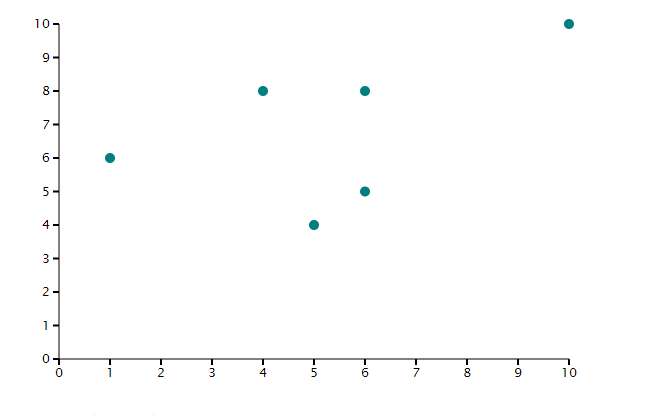

Draw a Simple Scatter Plot
=========================

1. Load the API into the page you would like your diagram using ``<php tripald3_load_libraries();?>``

.. code-block:: php

  function demo_my_example_preprocess(&$variables) {
        //the simple scatterplot takes in an array of arrays
        var scatterData = [[1, 6], [4, 8], [10,10], [6,8], [5,4],[6,5]];
    }

2. Add a container element where you would like you diagram drawn.

.. code-block:: html

  

    <!-- Javascript will add the Simple Scatter Chart, Title and Figure legend here -->
  

3. Draw the chart in your template by calling `tripalD3.drawChart()`. This is done within a script tag using Drupal behaviours to ensure it is run at the correct point and the data prepared is passed in.

.. code-block:: html
    

